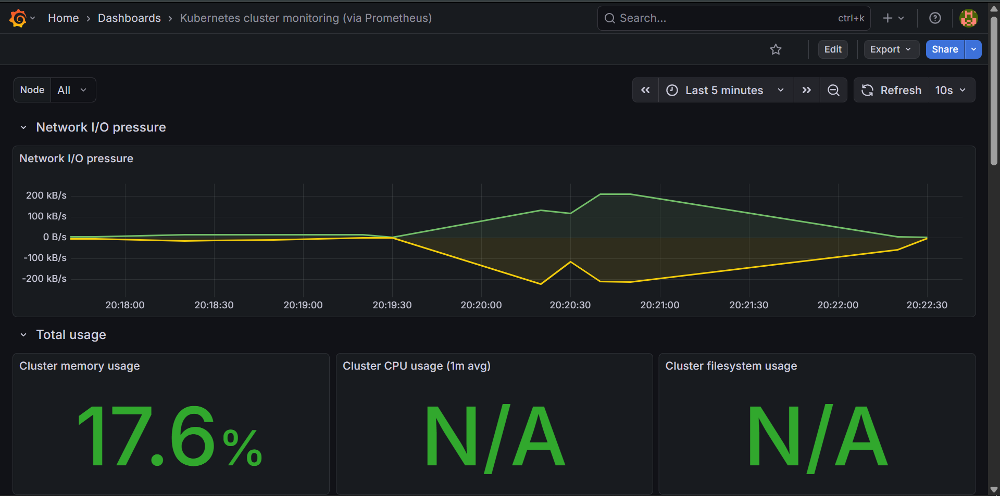

# 2048 on Amazon EKS — Production Simulation

**Author:** Oluwatunmise Asalu  
**Date:** May 2026  
**Stack:** AWS EKS · Kubernetes · Prometheus · Grafana · Helm · eksctl

A end-to-end Kubernetes project deploying the 2048 game on 
Amazon EKS, engineered to simulate production-grade decisions 
rather than follow a tutorial step by step.

This project covers containerised deployment, security hardening, 
autoscaling, observability, and deliberate stress testing — with 
an honest incident report documenting everything that broke, 
why it broke, and how it was fixed.

---

## Live Screenshots

### 2048 Game Running on EKS


### Grafana Cluster Monitoring Dashboard


---

## Architecture
┌─────────────────────────────────────┐
                │          AWS EKS Cluster             │
                │       (us-east-1, 2 nodes)           │
                │                                      │
Internet ──► ELB ──►│  ┌──────────┐     ┌──────────┐     │
│  │  Pod 1   │     │  Pod 2   │     │
│  │  2048    │     │  2048    │     │
│  └──────────┘     └──────────┘     │
│         ▲ HPA watches CPU           │
│         │ scales pods 2 → 6         │
│                                      │
│  ┌────────────────────────────┐     │
│  │    monitoring namespace     │     │
│  │   Prometheus + Grafana      │     │
│  └────────────────────────────┘     │
└─────────────────────────────────────┘
---

## What Makes This Different From the Tutorial

| Area | Tutorial | This Project |
|---|---|---|
| Cluster setup | AWS Console clicks | eksctl CLI — reproducible from a single YAML file |
| Deployment | Bare Pod, no limits | Deployment with resource limits, probes, security context |
| Autoscaling | None | HorizontalPodAutoscaler (min=2, max=6) |
| Exposure | Basic LoadBalancer | LoadBalancer with proper service labels |
| Observability | None | Prometheus + Grafana with real-time cluster dashboard |
| Validation | "it loads in browser" | Deliberate stress test, 11,500+ requests, findings documented |
| Documentation | Step-by-step how-to | Architecture + Design Decisions + Incident Report |

---

## Repository Structure
2048-eks-project/
├── cluster-config.yaml        # eksctl cluster definition
├── manifests/
│   ├── 2048-deployment.yaml   # hardened Deployment manifest
│   ├── 2048-service.yaml      # LoadBalancer service
│   └── 2048-hpa.yaml          # HorizontalPodAutoscaler
├── monitoring/
│   ├── alert-rules.yaml       # Prometheus alert rules
│   └── prometheus-values.yaml # Helm values
├── docs/
│   └── screenshots/           # Grafana dashboard, live game
├── INCIDENT.md                # stress test findings + incidents
└── README.md
---

## Prerequisites

- AWS account with IAM user and programmatic access
- Ubuntu, macOS, or WSL2
- The following tools installed:

```bash
aws --version       # AWS CLI
kubectl version     # Kubernetes CLI
eksctl version      # EKS cluster manager
helm version        # Kubernetes package manager
```

---

## Deployment Guide

### 1. Configure AWS credentials

```bash
aws configure
# Enter: Access Key ID, Secret Access Key, region (us-east-1), output (json)
```

Verify:
```bash
aws sts get-caller-identity
```

### 2. Spin up the EKS cluster

```bash
eksctl create cluster -f cluster-config.yaml
```

This creates:
- A managed EKS cluster named `2048-prod-cluster`
- A node group with 2x t3.medium EC2 instances (scales to 4)
- All required IAM roles and VPC networking
- OIDC provider enabled for service account IAM roles

Wait ~15 minutes, then verify:
```bash
kubectl get nodes
# Both nodes should show Ready
```

### 3. Deploy the application

```bash
kubectl apply -f manifests/2048-deployment.yaml
kubectl apply -f manifests/2048-service.yaml
kubectl apply -f manifests/2048-hpa.yaml
```

Watch pods come up:
```bash
kubectl get pods -w
```

Get the game URL:
```bash
kubectl get svc game-service
# Copy the EXTERNAL-IP and open in browser
```

### 4. Deploy monitoring stack

```bash
# Add Helm repositories
helm repo add prometheus-community https://prometheus-community.github.io/helm-charts
helm repo add grafana https://grafana.github.io/helm-charts
helm repo update

# Create monitoring namespace
kubectl create namespace monitoring

# Install Prometheus
helm install prometheus prometheus-community/prometheus \
  --namespace monitoring \
  --set alertmanager.enabled=false \
  --set prometheus-pushgateway.enabled=false \
  --set server.persistentVolume.enabled=false

# Install Grafana
helm install grafana grafana/grafana \
  --namespace monitoring \
  --set adminPassword=admin123 \
  --set persistence.enabled=false \
  --set service.type=LoadBalancer
```

Get the Grafana URL:
```bash
kubectl get svc grafana -n monitoring
```

Login with `admin` / `admin123`, add Prometheus as a data source:
http://prometheus-server.monitoring.svc.cluster.local

Import dashboard ID `315` for Kubernetes cluster monitoring.

### 5. Apply alert rules

```bash
kubectl apply -f monitoring/alert-rules.yaml
```

---

## Design Decisions

**Deployment over Pod**  
The tutorial deploys a bare Pod. Bare Pods cannot self-heal — 
if the node dies, the Pod is gone forever. A Deployment wraps 
pods with a controller that reschedules them automatically on 
healthy nodes. Non-negotiable for any real workload.

**eksctl over AWS Console**  
Console clicks are not reproducible. If the cluster needs to 
be rebuilt — different region, disaster recovery, new team 
member onboarding — a config file does it in one command. 
Console clicks require someone to remember every setting.

**Resource limits**  
Without limits, a misbehaving pod can consume all CPU and 
memory on a node, starving every other workload. Limits 
enforce a hard ceiling. Requests tell the scheduler how much 
to reserve when placing the pod on a node.

**Liveness and readiness probes**  
Liveness: if the app freezes, Kubernetes restarts it 
automatically without human intervention. Readiness: traffic 
only routes to pods that are confirmed ready to serve 
requests. Without these, users hit broken or warming-up pods.

**HorizontalPodAutoscaler**  
Scales pods based on CPU utilisation — min 2, max 6 replicas. 
The stress test revealed the actual bottleneck was the load 
balancer layer, not pod CPU. HPA correctly did not scale 
unnecessarily. Documented in INCIDENT.md.

**Separate monitoring namespace**  
Isolates the observability stack from the application. If 
monitoring breaks or is deleted, the game is completely 
unaffected. Standard production practice.

**Security context**  
`allowPrivilegeEscalation: false` prevents container processes 
from gaining elevated permissions even if exploited. An initial 
attempt to also drop all Linux capabilities caused a 
CrashLoopBackOff — fully diagnosed and documented in 
INCIDENT.md with root cause analysis and fix.

---

## Stress Test Summary

100 concurrent users, 3 minutes sustained load using `hey`.

| Metric | Run 1 | Run 2 |
|---|---|---|
| Requests/sec | 60.97 | 44.46 |
| Success rate | 99.97% | 99.99% |
| Median response | 1.00s | 1.26s |
| 99th percentile | 10.83s | 11.44s |
| HPA triggered | No — CPU peaked at 5% | No — CPU peaked at 5% |

**Key finding:** The bottleneck under load was the AWS Classic 
Load Balancer and DNS resolution latency — not the application 
pods. Pods remained healthy throughout with CPU never exceeding 
5%. Full analysis in [INCIDENT.md](./INCIDENT.md).

---

## Teardown

Always delete resources when done to avoid unnecessary AWS charges.

```bash
# Delete application
kubectl delete -f manifests/

# Delete monitoring
helm uninstall prometheus -n monitoring
helm uninstall grafana -n monitoring
kubectl delete namespace monitoring

# Delete cluster and all AWS resources
eksctl delete cluster -f cluster-config.yaml
```

**Estimated cost:** ~$0.15/hour while running.

---

## Incidents & Learnings

Three real incidents occurred during this project — all 
diagnosed and resolved. See [INCIDENT.md](./INCIDENT.md) for 
full root cause analysis on:

- Container image incompatibility with containerd v2.1
- CrashLoopBackOff from over-aggressive security hardening
- Prometheus installation timeout on fresh cluster
